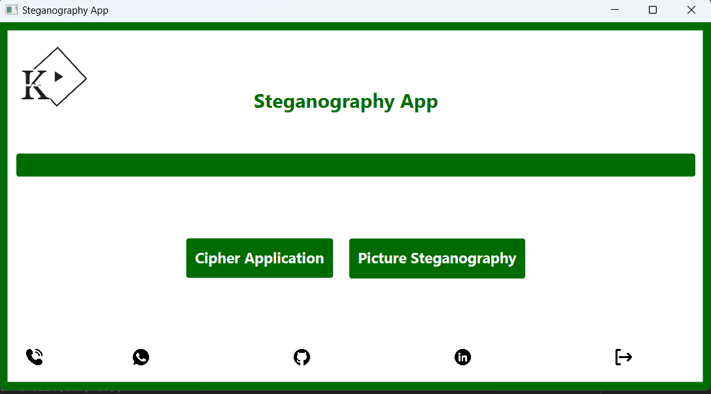
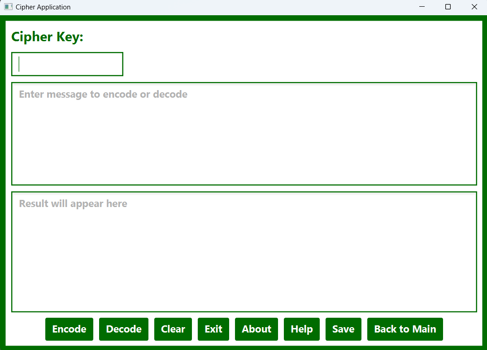
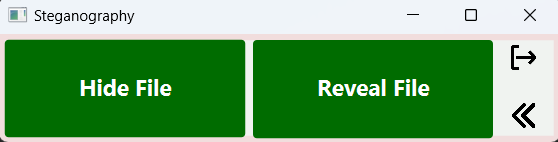
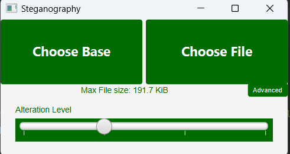

# Steganography in Java 

Steganography is the practice of concealing a file, message, image, or video within another file, message, image, or video. The word steganography combines the Greek words steganos (στεγανός), meaning "covered or protected", and graphein (γράφειν), meaning "writing". The first recorded use of the term steganography was in 1499, by Johannes Trithemius in his Steganographia, a treatise on cryptography and steganography, disguised as a book on magic. 

## Description

Java implementation of steganography algorithms in a simple GUI. The GUI is written in JavaFX along with the CSS styling. The project is built using Gradle. It mainly consists of two parts: 
<ul>
    <li>
        <a href="" > Text Steganography</a> | <a href="" > Image Steganography</a> 
        <ul>
             <li>Text Steganography was done using the Caesar cipher. The user can enter a message and a key to encrypt the message. The user can then decrypt the message by entering the key again.   </li>
        </ul>
        <ul> 
             <li>Image steganography is the process of hiding a file inside a picture. The file is hidden by changing the least significant bits of the pixels. </li>
        </ul> 
    </li>
</ul>

## Usage

1. Clone the repository

   > git clone https://github.com/Alibakhshov/Steganography.git

2. Open the project in your IDE (preferably IntelliJ IDEA)
3. Navigate to the `src/main/java/project/steganography/SteganographyApp.java` file
4. Run the `main()` method
5. Enjoy!

## Software and libraries used

- JavaFX
- Gradle
- CSS
- IntelliJ IDEA
- Git
- GitHub
- Markdown

## Planned features

- [ ] Add more steganography algorithms
- [ ] Add more documentation
- [ ] Add more features to the GUI
- [ ] Add Audio Steganography
- [ ] Add Video Steganography

## Screenshots

**1. Main Menu**

   

**2. Text Steganography**

   

**3. Image Steganography**

   

   

## Video Demonstration

](https://www.youtube.com/watch?v=AnD8wIUAcB0)

## Contributions

Anyone can contribute to this repository. If you want to contribute, please follow the steps below:

1. Fork this repository
2. Clone the forked repository
3. Create a new branch
4. Make changes to the code
5. Commit the changes
6. Push the changes to the forked repository
7. Create a pull request
8. Wait for the pull request to be merged
9. Repeat steps 1-8

## Contact

Any questions or suggestions? Feel free to contact me at

<a href="#top">back to top</a>

