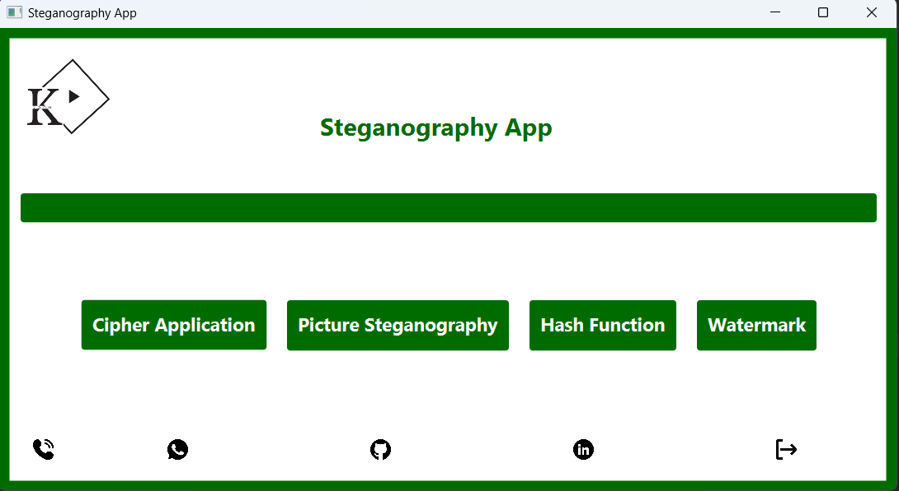

# Steganography in Java 

Steganography is the practice of concealing a file, message, image, or video within another file, message, image, or video. The word steganography combines the Greek words steganos (στεγανός), meaning "covered or protected", and graphein (γράφειν), meaning "writing". The first recorded use of the term steganography was in 1499, by Johannes Trithemius in his Steganographia, a treatise on cryptography and steganography, disguised as a book on magic. 

## Description

Java implementation of steganography algorithms in a simple GUI. The GUI is written in JavaFX along with the CSS styling. The project is built using Gradle. It mainly consists of two parts: 
<ul>
    <li>
        <a href="" > Text Steganography</a> | <a href="" > Image Steganography</a> 
        <ul>
             <li>Text Steganography was done using the Caesar cipher. The user can enter a message and a key to encrypt the message. The user can then decrypt the message by entering the key again.   </li>
        </ul>
        <ul> 
             <li>Image steganography is the process of hiding a file inside a picture. The file is hidden by changing the least significant bits of the pixels. </li>
        </ul> 
    </li>
</ul>

## Usage

1. Clone the repository

   > git clone https://github.com/Alibakhshov/Steganography.git

2. Open the project in your IDE (preferably IntelliJ IDEA)
3. Navigate to the `src/main/java/project/steganography/SteganographyApp.java` file
4. Run the `main()` method
5. Enjoy!

## Screenshots

**1. Main Menu**

   

**2. Text Steganography**

   

**3. Image Steganography**

   

   

